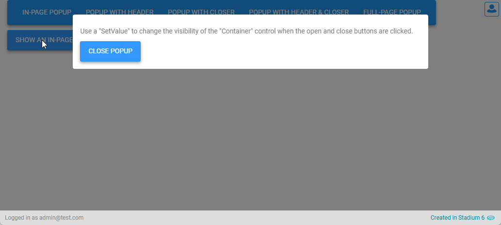
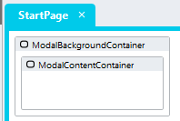
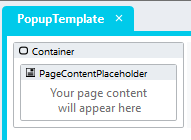
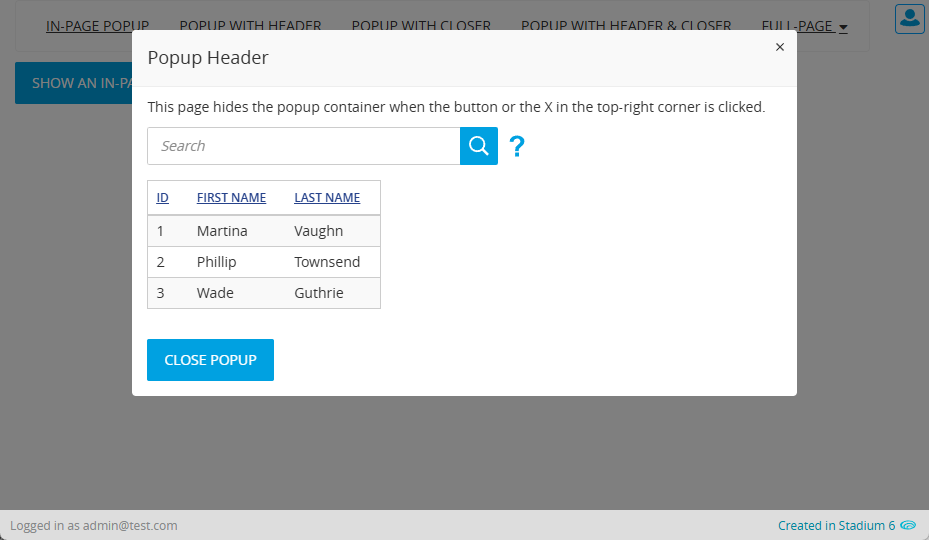
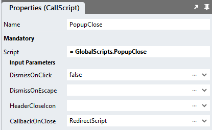
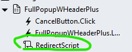

# Popups
This module provides two methods for creating popups, in-page and full-page. 

## Description
Popups serve to focus the attention of users on a particular set of UI elements. Popups are most appropriate for subtasks, such as adding or updating table rows before returning users back to the previous view. 



## Overview
1. Add a *Container* control to a page
2. Assign the class "stadium-popup" to the *Container*
3. Set the *Visible* property to *false*
4. Include the CSS for the module
5. Open the popup by setting the *Visible* property to *true*

## Contents <!-- omit in toc -->
- [Application Setup](#application-setup)
- [In-Page Popup](#in-page-popup)
   - [Page Setup](#page-setup)
   - [EventHandler](#eventhandler)
   - [Popup Headers](#popup-headers)
- [FullPage Popup](#fullpage-popup)
   - [FullPage Setup](#fullpage-setup)
   - [Opening and Closing FullPage Popups](#opening-and-closing-fullpage-popups)
   - [Full-Page Popup Headers](#full-page-popup-headers)
- [Dismiss Click, Escape Button Close and Closer (X) Icon Display](#dismiss-click-escape-button-close-and-closer-icon-x-display)
   - [Global Script](#global-script)
   - [Page.Load](#pageload)
- [CSS](#css)
   - [Before v6.12](#before-v612)
   - [v6.12+](#v612)
   - [Customising CSS](#customising-css)
- [Upgrading Stadium Repos](#upgrading-stadium-repos)

# Version
3.0 - Simplified setup; added script for header, callback script on close; added close on escape keypress; added closer icon

3.1 Simplified the CSS and made the default size of the popupcloser larger

# Application Setup
1. Check the *Enable Style Sheet* checkbox in the application properties

# In-Page Popup 
The in-page popup shows and hides a container on the page as the buttons are clicked. Use this method when pages are smaller and contain a managable number of elements. 

## Page Setup
1. Drag a *Container* control to a page
2. Add a class called "stadium-popup" to the *Container* control *Classes* property 
3. Set the *Visible* property of the *Container* control to "false"
4. Drag any controls you wish to display in the popup into control



### EventHandler
1. Drag a *SetValue* action into the Event Handler
   1. Set the Target property to: *Container.visible*
   2. Set the Value property to: *true* to show a popup or to *false* to hide it

### Popup Headers
Neatly styled popup titles can be added by:
1. Adding a *Label* control as the first control into a popup *Container*
2. Adding the class "stadium-popup-header" to the *Label*

# FullPage Popup
The full-page popup method makes complete pages appear to be popups. These pages use a Template that is styled to appear to be a popup. Use this method when pages become difficult to develop or maintain. 

## FullPage Setup
1. Create a new template and name it "PopupTemplate"
2. Drag a *Container* control into the "PopupTemplate"
3. Add a class called "stadium-popup" to the *Container* control *Classes* property 
4. Drag the *PageContentPlaceholder* into the *Container* control
5. Assign the "PopupTemplate" to pages to make them appear as popups



### Opening and Closing FullPage Popups
Navigate to a popup page to open pages that appear to be popups. 

Use a *NavigateToPage* action to navigate away from a popup page (usually back to the opening page) to make it appear as if the popup was closed. 

### Full-Page Popup Headers
To display a header in a full-page popup
1. Add a *Label* control as the first control into a popup page
2. Add the class "stadium-popup-header" to the control

# Dismiss Click, Escape Button Close and Closer Icon (X) Display
It may be is useful to allow users to close a popup by clicking the background, pressing the escape key or clicking an X in the top right corner of the popup. 



## Global Script
1. Create a Global Script called "PopupClose"
2. Add the input parameters below to the Global Script
   1. DismissOnClick
   2. DismissOnEscape
   3. HeaderCloseIcon
   4. CallbackOnClose
3. Drag a *JavaScript* action into the script
4. Add the Javascript below into the JavaScript code property
```javascript
/* Stadium Script v3.1 https://github.com/stadium-software/popups */
let scope = this;
let click = ~.Parameters.Input.DismissOnClick;
if (click !== false && click !== "false") {
    click = true;
}
let esc = ~.Parameters.Input.DismissOnEscape;
if (esc !== false && esc !== "false") {
    esc = true;
}
let header = ~.Parameters.Input.HeaderCloseIcon;
if (header !== false && header !== "false") {
    header = true;
}
let callScriptOnClose = ~.Parameters.Input.CallbackOnClose || false;
let popups = document.querySelectorAll(".stadium-popup");
let getObjectName = (obj) => {
    let objname = obj.id.replace("-container","");
    do {
        let arrNameParts = objname.split(/_(.*)/s);
        objname = arrNameParts[1];
    } while ((objname.match(/_/g) || []).length > 0 && !scope[`${objname}Classes`]);
    return objname;
};
let tries = 0;
let wait = async (milliseconds) => new Promise((resolve) => setTimeout(resolve, milliseconds));
let scriptCaller = async (script) => {
    tries++;
    if (tries > 20) {
    	return false;
    } else {
        try {
            await scope[script]();
            return true;
        } catch (error) {
            wait(100).then(() => scriptCaller(script));
        }
    }
};
if (click) document.querySelector(".container").addEventListener("click", closeOnClick);
if (esc) {
    document.querySelector(".container").setAttribute("closeOnEscape", true);
    document.addEventListener("keydown", closeOnKeyPress);
}
if (header) {
    for (let i = 0; i < popups.length; i++) {
        attachHeaderClose(popups[i]);
    }
}
function setDMValues(ob, property, value) {
    let obname = getObjectName(ob);
    scope[`${obname}${property}`] = value;
}
function closeOnClick(e) {
    if (!e.target.closest(".stadium-popup")) {
        for (let i = 0; i < popups.length; i++) {
            closePopup(popups[i]);
        }
    }
}
function closeOnKeyPress(e) {
    if(e.key === "Escape" && document.querySelector(".container").getAttribute("closeOnEscape")) {
        for (let i = 0; i < popups.length; i++) {
            closePopup(popups[i]);
        }
    }
}
function closePopup(el) {
    setDMValues(el, "Visible", false);
    if (callScriptOnClose) scriptCaller(callScriptOnClose);
}
function attachHeaderClose(el) {
    let head = el.querySelectorAll(".stack-layout-container")[0];
    let template = el.querySelector(".page-content");
    if (template) {
        head = template.querySelectorAll(".stack-layout-container")[0];
    }
    let headerCloser = document.createElement("div");
    headerCloser.classList.add("stadium-popup-closer");
    headerCloser.addEventListener("click", () => {
        closePopup(el);
    });
    head.appendChild(headerCloser);
}
```

## Page.Load
1. Drag the global script called "PopupClose" into the Page.Load event Handler
2. Provide values for the script input parameters
   1. DismissOnClick (boolean): Add *false* to disable closing popups by clicking on the background (default true)
   2. DismissOnEscape (boolean): Add *false* to disable closing popups by pressing the escape key (default true)
   3. HeaderCloseIcon (boolean): Add *false* to hide the X icon in the top right corner of the popup (default true)
   4. CallbackOnClose (string): Add a page script and provide it's name here. The script will be called when the popup is closed using the dismiss click, escape key or the closer icon. 





# CSS
The CSS below is required for the correct functioning of the module. Variables exposed in the [*popup-variables.css*](popup-variables.css) file can be [customised](#customising-css).

### Before v6.12
1. Create a folder called "CSS" inside of your Embedded Files in your application
2. Drag the two CSS files from this repo [*popup-variables.css*](popup-variables.css) and [*popup.css*](popup.css) into that folder
3. Paste the link tags below into the *head* property of your application
```html
<link rel="stylesheet" href="{EmbeddedFiles}/CSS/popup.css">
<link rel="stylesheet" href="{EmbeddedFiles}/CSS/popup-variables.css">
``` 

### v6.12+
1. Create a folder called "CSS" inside of your Embedded Files in your application
2. Drag the CSS files from this repo [*popup.css*](popup.css) into that folder
3. Paste the link tag below into the *head* property of your application
```html
<link rel="stylesheet" href="{EmbeddedFiles}/CSS/popup.css">
``` 

### Customising CSS
1. Open the CSS file called [*popup-variables.css*](popup-variables.css) from this repo
2. Adjust the variables in the *:root* element as you see fit
3. Stadium 6.12+ users can comment out any variable they do **not** want to customise
4. Add the [*popup-variables.css*](popup-variables.css) to the "CSS" folder in the EmbeddedFiles (overwrite)
5. Paste the link tag below into the *head* property of your application (if you don't already have it there)
```html
<link rel="stylesheet" href="{EmbeddedFiles}/CSS/popup-variables.css">
``` 
6. Add the file to the "CSS" inside of your Embedded Files in your application

**NOTE: Do not change any of the CSS in the 'popup.css' file**

## Upgrading Stadium Repos
Stadium Repos are not static. They change as additional features are added and bugs are fixed. Using the right method to work with Stadium Repos allows for upgrading them in a controlled manner. 

How to use and update application repos is described here: [Working with Stadium Repos](https://github.com/stadium-software/samples-upgrading)