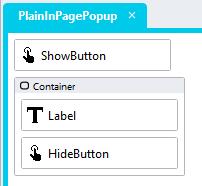

# Popups
This module provides two methods for creating popups, in-page and full-page. 

## Description
Popups serve to focus the attention of users on a particular set of UI elements. Popups are most appropriate for subtasks, such as adding or updating table rows before returning users back to the previous view. 


## Overview
1. Add a *Container* control to a page
2. Assign a class to the *Container* (e.g. popup)
3. Set the *Visible* property to *false*
4. Include the Popup global script in the Page.Load event handler and complete the input parameters
5. Open the popup by setting the *Visible* property to *true*

## Contents <!-- omit in toc -->
1. [Popups](#popups)
   1. [Description](#description)
   2. [Overview](#overview)
2. [Version](#version)
   1. [Change Log](#change-log)
3. [Application Setup](#application-setup)
   1. [Popup Global Script](#popup-global-script)
4. [In-Page Popup](#in-page-popup)
   1. [Page Setup](#page-setup)
      1. [Page.Load EventHandler](#pageload-eventhandler)
      2. [Showing a Popup](#showing-a-popup)
      3. [Hiding a Popup](#hiding-a-popup)
      4. [Popup Headers](#popup-headers)
   2. [Multiple Popups With Different Settings](#multiple-popups-with-different-settings)
5. [FullPage Popup](#fullpage-popup)
   1. [FullPage Setup](#fullpage-setup)
      1. [Popup Template](#popup-template)
      2. [FullPage Popup Page](#fullpage-popup-page)
      3. [Opening FullPage Popups](#opening-fullpage-popups)
      4. [Closing FullPage Popups](#closing-fullpage-popups)
      5. [Full-Page Popup Headers](#full-page-popup-headers)
6. [CSS](#css)
      1. [Customising CSS](#customising-css)
   1. [Upgrading Stadium Repos](#upgrading-stadium-repos)

# Version
3.4

## Change Log
3.0 - Simplified setup; added script for header, callback script on close; added close on escape keypress; added closer icon

3.1 Simplified the CSS, made the default size of the popup closer icon larger and allowed for the changing of the icon colour using a variable

3.2 Integrated CSS with script - all popups must be invoked using the script regardless of whether the dismiss on click, escape key or closer icon features are used or not. Version 3.2 is backwards compatible to v3.1. Upgrading a current implementation to this version of the script does not require any changes to existing pages.

3.3 Fixed escape close bug when multiple popups are present on a page

3.4 Fixed CSS not applied bug

# Application Setup
1. Check the *Enable Style Sheet* checkbox in the application properties

## Popup Global Script
1. Create a Global Script called "Popup"
2. Add the input parameters below to the Global Script
   1. DismissOnClick
   2. DismissOnEscape
   3. HeaderCloseIcon
   4. CallbackOnClose
   5. PopupContainerClass
3. Drag a *JavaScript* action into the script
4. Add the Javascript below into the JavaScript code property
```javascript
/* Stadium Script v3.4 https://github.com/stadium-software/popups */
let scope = this;
let popupClassName = ~.Parameters.Input.PopupContainerClass;
let click = ~.Parameters.Input.DismissOnClick;
loadCSS();
if (click !== false && click !== "false") {
    click = true;
}
let esc = ~.Parameters.Input.DismissOnEscape;
if (esc !== false && esc !== "false") {
    esc = true;
}
let header = ~.Parameters.Input.HeaderCloseIcon;
if (header !== false && header !== "false") {
    header = true;
}
let callScriptOnClose = ~.Parameters.Input.CallbackOnClose || false;
if (!popupClassName) {
    popupClassName = ".stadium-popup";
} else { 
    popupClassName = `.${popupClassName}`;
}
let popups = document.querySelectorAll(popupClassName);
for (let i = 0; i < popups.length; i++) {
    popups[i].classList.add("stadium-popup");
}
let getObjectName = (obj) => {
    let objname = obj.id.replace("-container","");
    do {
        let arrNameParts = objname.split(/_(.*)/s);
        objname = arrNameParts[1];
    } while ((objname.match(/_/g) || []).length > 0 && !scope[`${objname}Classes`]);
    return objname;
};
let tries = 0;
let wait = async (milliseconds) => new Promise((resolve) => setTimeout(resolve, milliseconds));
let scriptCaller = async (script) => {
    tries++;
    if (tries > 20) {
    	return false;
    } else {
        try {
            await scope[script]();
            return true;
        } catch (error) {
            wait(100).then(() => scriptCaller(script));
        }
    }
};
if (click) document.querySelector(".container").addEventListener("click", closeOnClick);
if (esc) {
    document.querySelector(".container").setAttribute("closeOnEscape", true);
    if (!window.popupEscapeListenerAttached) {
        document.addEventListener("keydown", closeOnKeyPress);
        window.popupEscapeListenerAttached = true;
    }
}
if (header) {
    for (let i = 0; i < popups.length; i++) {
        attachHeaderClose(popups[i]);
    }
}
function setDMValues(ob, property, value) {
    let obname = getObjectName(ob);
    scope[`${obname}${property}`] = value;
}
function closeOnClick(e) {
    if (!e.target.closest(".stadium-popup")) {
        for (let i = 0; i < popups.length; i++) {
            closePopup(popups[i]);
        }
    }
}
function closeOnKeyPress(e) {
    if(e.key === "Escape" && document.querySelector(".container").getAttribute("closeOnEscape")) {
        for (let i = 0; i < popups.length; i++) {
            closePopup(popups[i]);
        }
    }
}
function closePopup(el) {
    setDMValues(el, "Visible", false);
    if (callScriptOnClose) scriptCaller(callScriptOnClose);
}
function attachHeaderClose(el) {
    let head = el.querySelectorAll(".stack-layout-container")[0];
    let template = el.querySelector(".page-content");
    if (template) {
        head = template.querySelectorAll(".stack-layout-container")[0];
    }
    let headerCloser = head.querySelector(".stadium-popup-closer");
    if (headerCloser) return;
    headerCloser = document.createElement("div");
    headerCloser.classList.add("stadium-popup-closer");
    headerCloser.addEventListener("click", () => {
        closePopup(el);
    });
    head.appendChild(headerCloser);
}
function loadCSS() {
    let moduleID = "stadium-popups";
    if (!document.getElementById(moduleID)) {
        let cssMain = document.createElement("style");
        cssMain.id = moduleID;
        cssMain.type = "text/css";
        cssMain.textContent = `html .stadium-popup {
    position: fixed;
    margin: var(--stadium-popup-top-margin, 3rem) auto 0 auto;
    background-color: var(--stadium-popup-background-color, var(--BODY-BACKGROUND-COLOR, white));
    border-radius: var(--stadium-popup-border-radius, 0.4rem);
    border: var(--stadium-popup-border-width, 0) var(--stadium-popup-border-style, solid) var(--stadium-popup-border-color, var(--LIGHT-GREY, transparent));
    box-shadow: var(--stadium-popup-box-shadow, var(--BOX-SHADOW-COLOR, 0 8px 32px rgba(0, 0, 0, 0.3)));
    overflow: auto;
    max-height: calc(96vh - var(--stadium-popup-top-margin, 3rem) - var(--BODY-FOOTER-HEIGHT));
    max-width: 96vw;
    z-index: 1001;
    inset: 0;
    width: fit-content;
    height: fit-content;
    &:not(:has(.page-content)),
    &:has(.page-content) .page-content {
        & > .stack-layout-container:first-child > .control-container {
            margin-top: 0;
        }
        & > .stack-layout-container {
            padding-right: var(--stadium-popup-header-right-padding, var(--BODY-CONTAINER-RIGHTLEFT-PADDING, 1.4rem));
            padding-left: var(--stadium-popup-header-left-padding, var(--BODY-CONTAINER-RIGHTLEFT-PADDING, 1.4rem));
        }
        & > .stack-layout-container:first-child {
            padding-top: var(--stadium-popup-header-top-padding, calc(var(--BODY-CONTAINER-RIGHTLEFT-PADDING, 1.4rem)));
        }
        & > .stack-layout-container:last-child {
            padding-bottom: var(--stadium-popup-header-bottom-padding, calc(var(--BODY-CONTAINER-RIGHTLEFT-PADDING, 1.4rem)));
        }
    }
    &:not(:has(.stadium-popup-header)) {
        & > .stack-layout-container:first-child > .control-container {
            margin-top: 0;
            padding-right: calc(var(--stadium-popup-header-right-padding, var(--BODY-CONTAINER-RIGHTLEFT-PADDING, 1.4rem)) + var(--stadium-popup-close-icon-size, 3rem) / 2);
        }
        & .stadium-popup-closer {
            position: absolute;
            top: var(--stadium-popup-close-icon-top-position, 1rem);
            right: var(--stadium-popup-close-icon-right-position, 1rem);
        }
    }
    &:has(.stadium-popup-header) {
        & > .stack-layout-container:first-child > .control-container {
            margin-top: 0;
        }
        & .stack-layout-container:has(> .stadium-popup-header) {
            display: flex;
            align-items: center;
            background-color: var(--stadium-popup-header-background-color, var(--GENERAL-BORDER-COLOR, #eee));
            border-bottom: var(--stadium-popup-header-bottom-border-width, 0.1rem) solid var(--stadium-popup-header-bottom-border-color, var(--GENERAL-BORDER-COLOR, #eee));
            padding-top: var(--stadium-popup-header-top-padding, calc(var(--BODY-CONTAINER-RIGHTLEFT-PADDING, 1.4rem)));
            padding-right: var(--stadium-popup-header-right-padding, var(--BODY-CONTAINER-RIGHTLEFT-PADDING, 1.4rem));
            padding-bottom: var(--stadium-popup-header-bottom-padding, calc(var(--BODY-CONTAINER-RIGHTLEFT-PADDING, 1.4rem)));
            padding-left: var(--stadium-popup-header-left-padding, var(--BODY-CONTAINER-RIGHTLEFT-PADDING, 1.4rem));
        }

    }
    & .stadium-popup-header {
        display: flex;
        justify-content: var(--stadium-popup-header-alignment, left);
        font-size: var(--stadium-popup-header-font-size, var(--FONT-SIZE-LARGE, 2.2rem));
        color: var(--stadium-popup-header-font-color, var(--BODY-FONT-COLOR, #333333));
        margin-top: 0;
    }
    & .stadium-popup-closer {
        margin-left: auto;
        background-color: var(--stadium-popup-header-font-color, var(--LABEL-TEXT-COLOR, #6f6f6f));
        mask-image: var(--stadium-popup-close-icon, url("data:image/svg+xml,%3Csvg xmlns='http://www.w3.org/2000/svg' width='1em' height='1em' viewBox='0 0 24 24'%3E%3C!-- Icon from Gridicons by Automattic - https://github.com/Automattic/gridicons/blob/trunk/LICENSE.md --%3E%3Cpath fill='currentColor' d='M18.36 19.78L12 13.41l-6.36 6.37l-1.42-1.42L10.59 12L4.22 5.64l1.42-1.42L12 10.59l6.36-6.36l1.41 1.41L13.41 12l6.36 6.36z'/%3E%3C/svg%3E"));
        mask-repeat: no-repeat;
        mask-position: center;
        mask-size: contain;
        background-repeat: no-repeat;
        background-size: var(--stadium-popup-close-icon-size, 3rem);
        background-position: center;
        height: var(--stadium-popup-close-icon-size, 3rem);
        width: var(--stadium-popup-close-icon-size, 3rem);
        cursor: pointer;
    }
}
html .stack-layout-container:has(> .stadium-popup:not([style*="display: none"]))::after {
        content: "";
        position: fixed;
        display: block;
        width: 100vw;
        height: 100vh;
        top: 0;
        left: 0;
        bottom: 0;
        right: 0;
        background-color: var(--stadium-popup-backdrop-color, var(--MODAL-OVERLAY-COLOR, rgb(0 0 0 / 25%)));
        z-index: 1000;
        backdrop-filter: var(--stadium-popup-backdrop-filter, none);
}`;
        document.head.appendChild(cssMain);
    }
}
```

# In-Page Popup 
The in-page popup shows and hides a container on the page as the buttons are clicked. Use this method when pages are smaller and contain a managable number of elements. 

## Page Setup
1. Drag a *Container* control to a page
2. Add a class of your choosing to the *Container* control *Classes* property (e.g. popup)
3. Set the *Visible* property of the *Container* control to "false"
4. Drag any controls you wish to display in the popup into control



### Page.Load EventHandler
1. Drag the global script called "Popup" into the Page.Load Event Handler
2. Complete the input parameters as required
   1. DismissOnClick (boolean): Add *false* to disable closing popups by clicking on the background (default true)
   2. DismissOnEscape (boolean): Add *false* to disable closing popups by pressing the escape key (default true)
   3. HeaderCloseIcon (boolean): Add *false* to hide the X icon in the top right corner of the popup (default true)
   4. CallbackOnClose (string): Add a page script and provide it's name here. The script will be called when the popup is closed using the dismiss click, escape key or the closer icon. 
   5. PopupContainerClass (string): Provide the class you assigned to the popup containers here (e.g. popup)


### Showing a Popup
1. Drag a *SetValue* action into an Event Handler
   1. Set the Target property to: *Container.visible*
   2. Set the Value property to: *true* to show a popup

### Hiding a Popup
1. Drag a *SetValue* action into an Event Handler
   1. Set the Target property to: *Container.visible*
   2. Set the Value property to: *false* to show a popup

### Popup Headers
Pre-styled popup titles can be added by:
1. Adding a *Label* control as the first control into a popup *Container*
2. Adding the class "stadium-popup-header" to the *Label*


## Multiple Popups With Different Settings
To have multiple popups on a page with different settings:
1. Create multiple *Container* controls on a page
2. Add different class names to each *Container* control
3. In the Page.Load Event Handler, drag multiple instances of the global "Popup" script
4. For each instance of the script, provide the different class names in the *PopupContainerClass* input parameter
5. Complete the other input parameters as required for each popup
6. Open and close each popup as required using the *Container.Visible* property

# FullPage Popup
The full-page popup method makes complete pages appear to be popups. These pages use a Template that is styled to appear to be a popup. Use this method when pages become difficult to develop or maintain. 

## FullPage Setup

### Popup Template
1. Create a new template and name it "PopupTemplate"
2. Drag a *Container* control into the "PopupTemplate"
3. Add a class of your choosing to the *Container* control *Classes* property (e.g. popup)
4. Drag the *PageContentPlaceholder* into the *Container* control
5. Assign the "PopupTemplate" to pages to make them appear as popups

### FullPage Popup Page
1. Drag the global script called "Popup" into the Page.Load Event Handler of each popup page
2. Leave the *Container.Visible* property as *true*
3. Complete the input parameters as required
   1. DismissOnClick (boolean): Add *false* to disable closing popups by clicking on the background (default true)
   2. DismissOnEscape (boolean): Add *false* to disable closing popups by pressing the escape key (default true)
   3. HeaderCloseIcon (boolean): Add *false* to hide the X icon in the top right corner of the popup (default true)
   4. CallbackOnClose (string): Add a page script and provide it's name here. The script will be called when the popup is closed using the dismiss click, escape key or the closer icon. 
   5. PopupContainerClass (string): Provide that class you assigned to the popup container here (e.g. popup)


### Opening FullPage Popups
Navigate to a popup page to make that page appear to be popups. 

### Closing FullPage Popups
1. Add a page script to the FullPage popup page
2. Drag a *NavigateToPage* action into the script that navigates back to the opening page to make it appear as if the popup was closed
3. Add the script name to the *CallbackOnClose* input parameter of the global "Popup" script (see above)
4. Call the script in any Event Handler to close the popup
5. The script will also be called when users close the popup using the dismiss click, escape key or the closer icon


### Full-Page Popup Headers
To display a header in a full-page popup
1. Add a *Label* control as the first control into a popup page
2. Add the class "stadium-popup-header" to the control


# CSS
Variables exposed in the [*popup-variables.css*](popup-variables.css) file can be [customised](#customising-css).

1. Create a folder called "CSS" inside of your Embedded Files in your application
2. Drag the CSS files from this repo [*popup.css*](popup.css) into that folder
3. Paste the link tag below into the *head* property of your application
```html
<link rel="stylesheet" href="{EmbeddedFiles}/CSS/popup.css">
``` 

### Customising CSS
1. Open the CSS file called [*popup-variables.css*](popup-variables.css) from this repo
2. Adjust the variables in the *:root* element as you see fit
3. Stadium 6.12+ users can comment out any variable they do **not** want to customise
4. Add the [*popup-variables.css*](popup-variables.css) to the "CSS" folder in the EmbeddedFiles (overwrite)
5. Paste the link tag below into the *head* property of your application (if you don't already have it there)
```html
<link rel="stylesheet" href="{EmbeddedFiles}/CSS/popup-variables.css">
``` 
6. Add the file to the "CSS" inside of your Embedded Files in your application

## Upgrading Stadium Repos
Stadium Repos are not static. They change as additional features are added and bugs are fixed. Using the right method to work with Stadium Repos allows for upgrading them in a controlled manner. 

How to use and update application repos is described here: [Working with Stadium Repos](https://github.com/stadium-software/samples-upgrading)